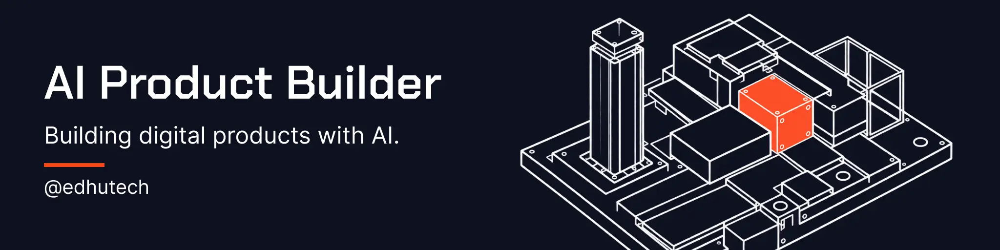

# Hi, I'm Edhú Nuñez 👋

**AI Product Builder · Product Manager**

I build digital products at the intersection of **AI, product, and software development**, from identifying opportunities and defining the product to building and shipping working solutions.

Currently, I'm especially interested in **AI-assisted software development, developer tools, product engineering, and agentic workflows**.

## 🚀 What I'm working on

### [Nerv](https://github.com/edhutech/nerv)

**Local-first work harness for coding-agent projects.**

Nerv helps coding agents work with the right product and repository context while keeping execution structured through tasks, runs, reviews, and checkpoints.

`Open Source` · `Apache-2.0` · `Developer Tools` · `AI Agents`

## 🧭 Current focus

- Building AI-powered digital products
- Exploring Product Engineering and AI-assisted development
- Creating tools and workflows for coding agents
- Contributing to open-source projects
- Helping teams turn ideas into working products

## ⚙️ Tech Stack & Tools

**Build**

  
  
  

**Test, Ship & Operate**

  
  
  

**Developer Workflow**

  
  

**AI-powered Workflow**

  
  
  
  
  

## 🔗 Connect

